# Attrition-analysis-using-sql

## 📌 Overview
This project performs **Funnel Analysis** on user journey data to understand how users move through different stages of an e-commerce or product flow.  
The analysis is implemented using **Python (Pandas, Matplotlib, Plotly, Seaborn,plotly)** inside a Jupyter Notebook.

## 🎯 Problem Statement
The goal of this project is to analyze user behavior across different funnel stages:

- Homepage → Product Page → Cart → Checkout → Purchase

## 🧠 Project Structure 
#### Cleaning and Transform data 

1. Data types
2. Data Consistency Stage
3. Null values
4. Outliers
5. Create new columns (Date , Time , Total Sessions Per User, Purchase Counts Per User,Time Segments)

#### EDA

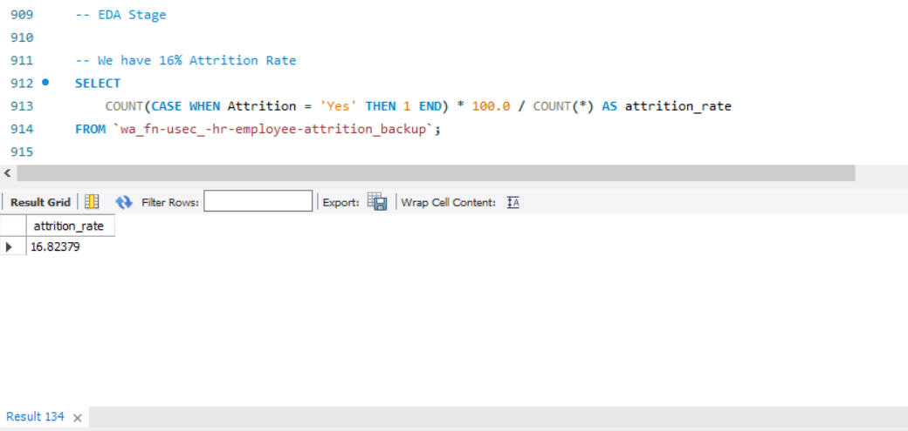
 
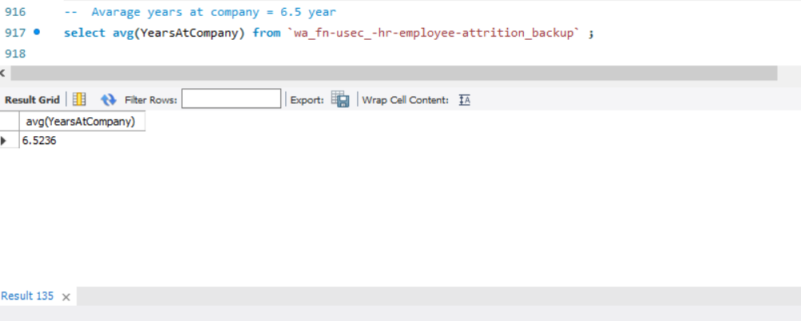
 
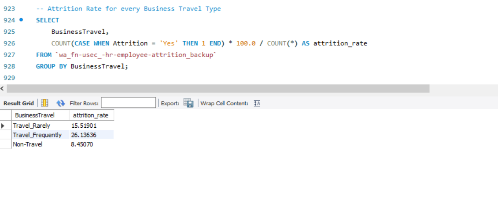
 
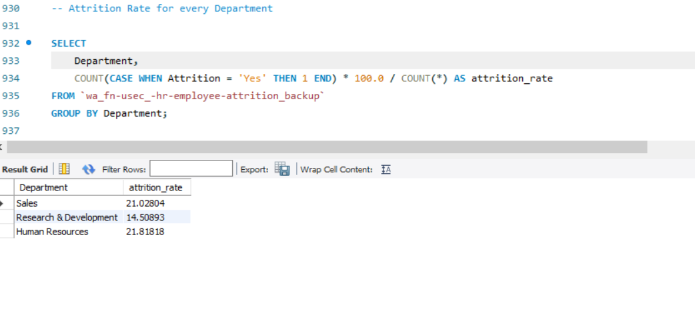
 
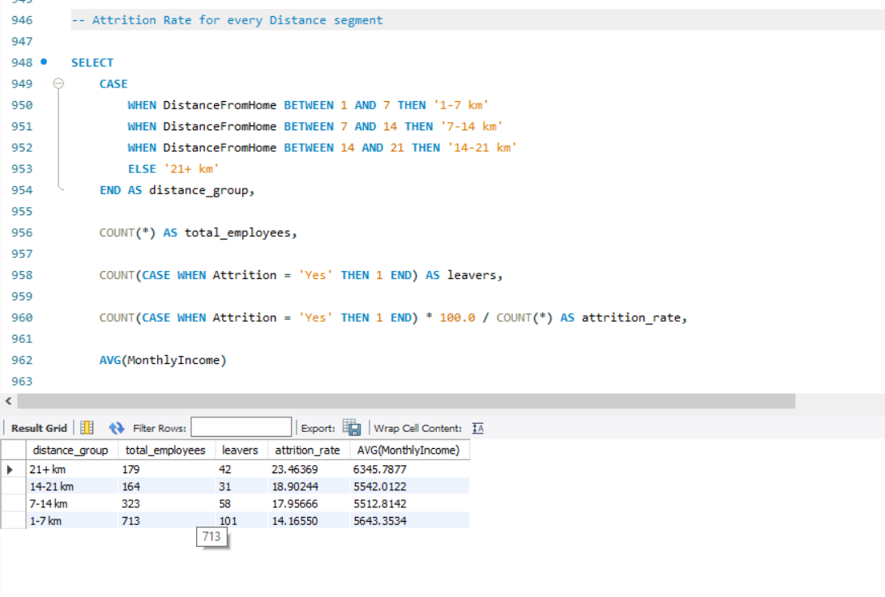
 
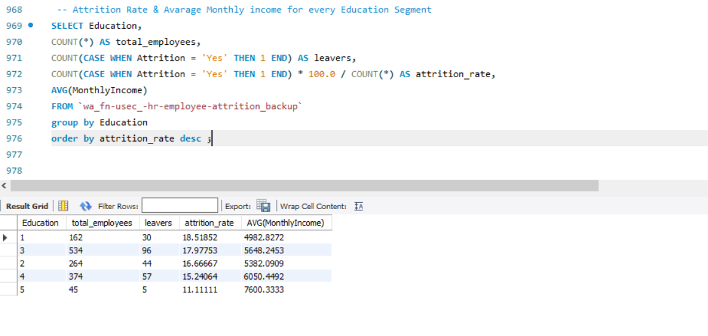
 
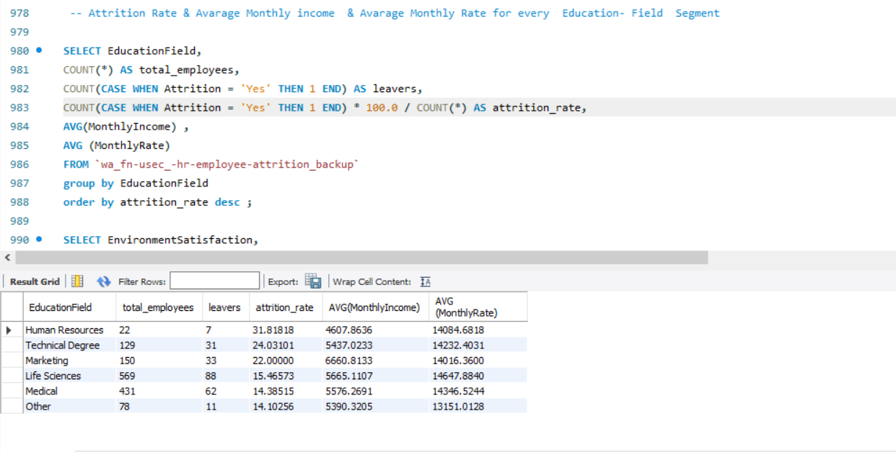
 
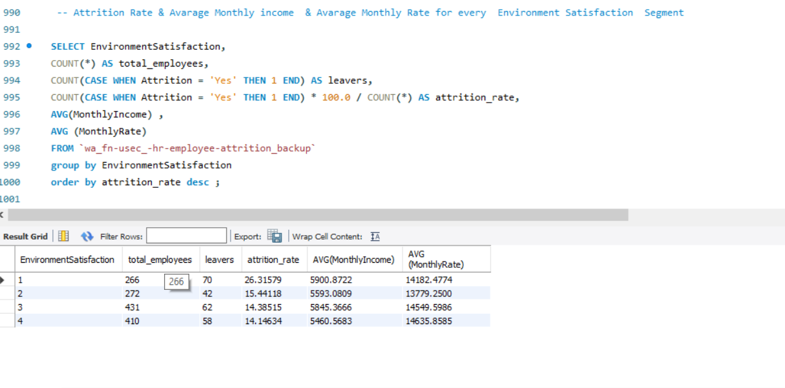
 
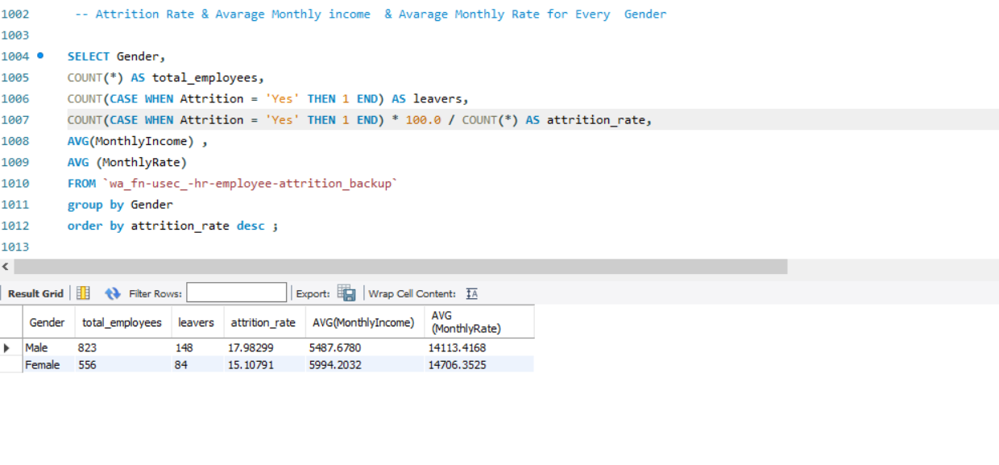
 
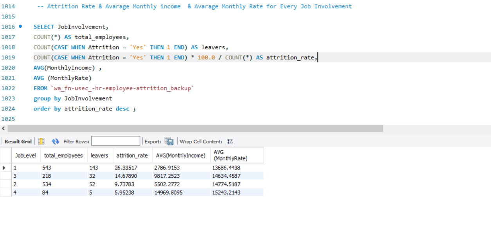
 
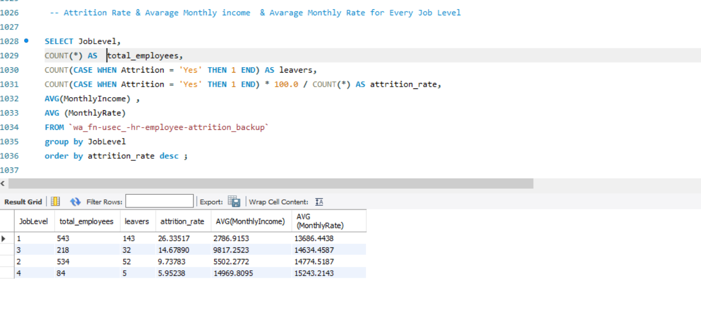
 
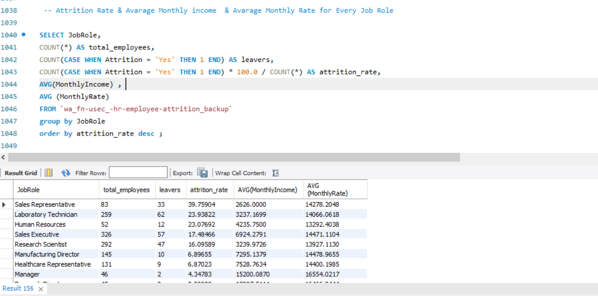
 
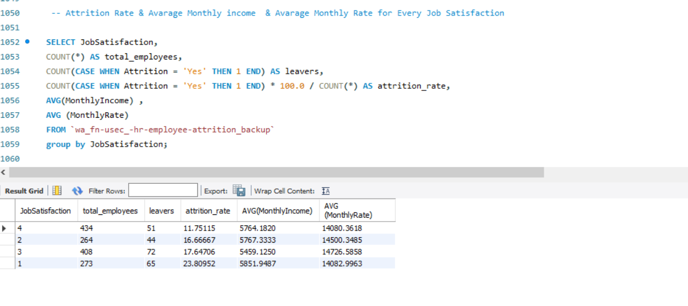
 
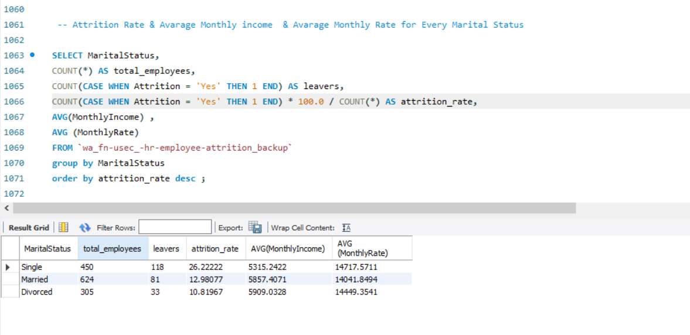
 
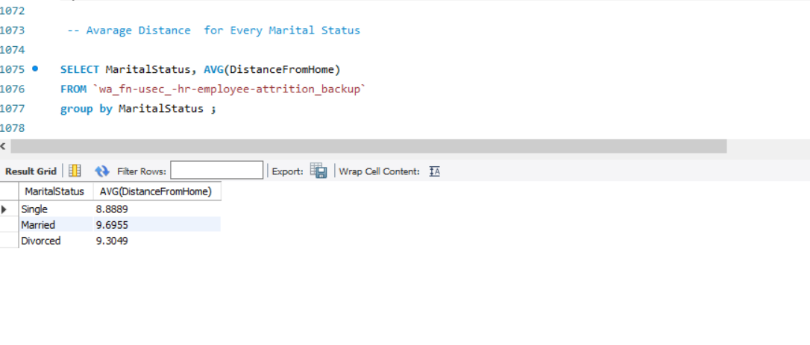
 
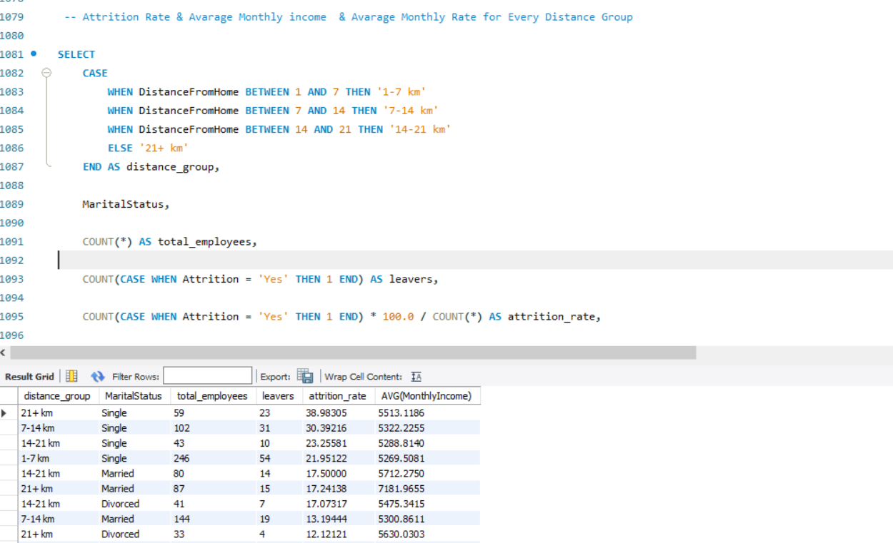
 
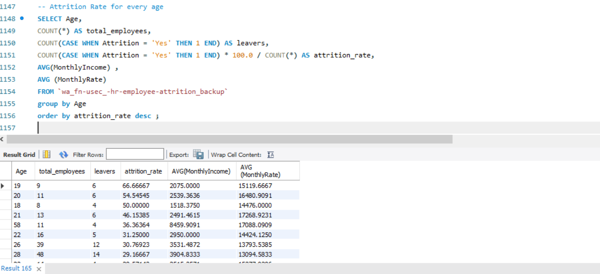
 
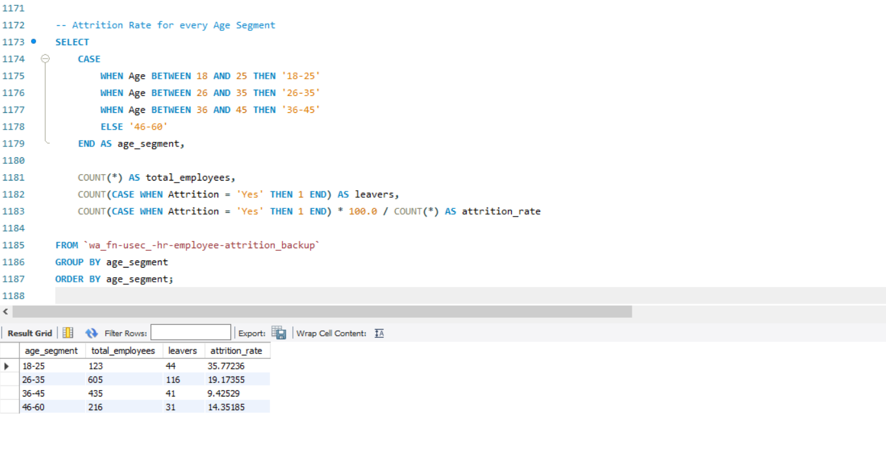
 

## 📝 Summary

1. Attrition Rate is **16.8%**
2. Average Years at Company is **6.5**
3. Total Number of Employees is **1470**
4. Average Job Satisfaction is **2.7**
5. The highest attrition rate comes from **Sales Representatives**
6. The highest attrition rate comes from **younger age groups**
7. Stock options reduce the attrition rate
